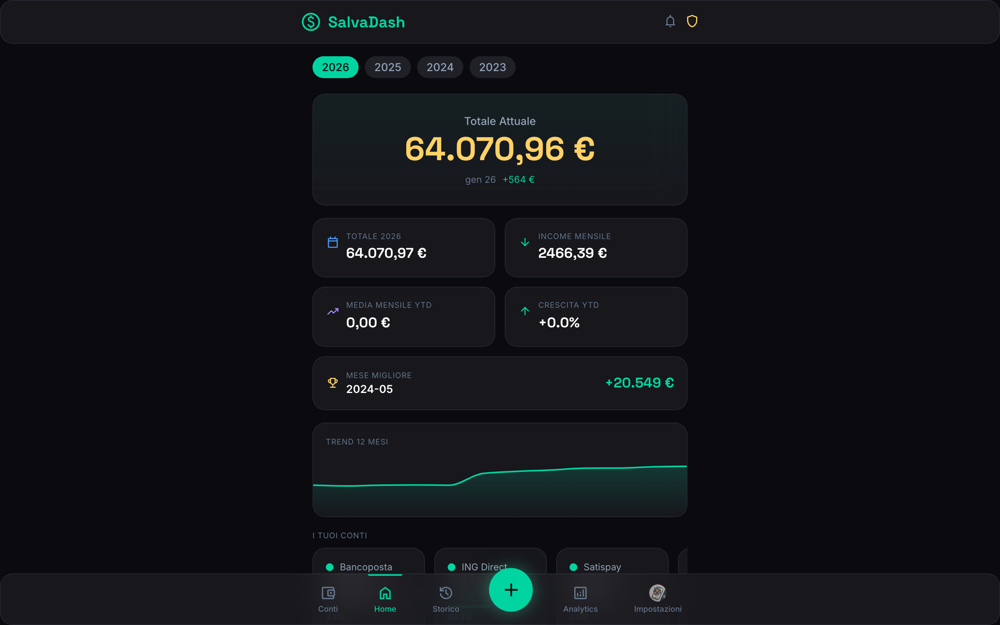

<div align="center">

# SalvaDash

**Il tuo tracker di risparmi personale — bello, veloce, tuo.**

[](https://github.com/GitBakko/salvadash/actions/workflows/ci.yml)
[](LICENSE)
[](https://www.typescriptlang.org/)
[](https://react.dev/)
[](https://vite.dev/)
[](https://www.prisma.io/)
[](https://www.postgresql.org/)

<br />



_Tieni traccia dei tuoi risparmi mese dopo mese. Visualizza trend, obiettivi e crescita — tutto in un'app installabile._

</div>

---

## Perche SalvaDash

La maggior parte delle app finanziarie e troppo complicata o troppo limitata. SalvaDash e un **tracker di risparmi mensile** progettato per chi vuole una visione chiara dei propri soldi senza collegare conti correnti ne condividere dati sensibili.

- **Dashboard in tempo reale** — totale risparmi, delta mensile/annuale, trend con grafici interattivi
- **PWA installabile** — funziona offline, notifiche push, aggiungilo alla home del telefono
- **Multi-conto** — conti principali e sotto-conti con icone e colori personalizzati
- **Fonti di reddito** — traccia stipendio, freelance, investimenti separatamente
- **Analytics avanzati** — grafici Recharts con breakdown per conto, periodo e fonte di reddito
- **Multilingua** — Italiano e Inglese con switch istantaneo
- **Multi-utente** — sistema di inviti con ruoli (Root, Admin, Base)
- **Notifiche** — reminder mensili via email e push notification
- **Export** — esporta i tuoi dati in Excel in un click
- **Backup automatici** — pg_dump schedulato con retention policy
- **Sicuro** — JWT con refresh token httpOnly, bcrypt, validazione Zod end-to-end

---

## Architettura

```
salvadash/
├── frontend/          React 19 - Vite 6 - TanStack Router/Query - Tailwind v4
├── backend/           Express - TypeScript - Prisma 7 - PostgreSQL 16
├── shared/            Zod schemas - Tipi condivisi (compilato)
├── docker-compose.yml PostgreSQL dev container
└── package.json       pnpm monorepo workspace
```

| Layer | Stack |
| --- | --- |
| **Frontend** | React 19, Vite 6, TanStack Router & Query, Zustand, Framer Motion, Recharts, Tailwind CSS v4, Dexie (IndexedDB), i18next |
| **Backend** | Express 4, Prisma 7, JWT auth (access + refresh), Nodemailer, Web Push, node-cron, XLSX export |
| **Shared** | Zod schemas, TypeScript types — contratto API type-safe end-to-end |
| **Infra** | Docker Compose (dev), PM2 (prod), IIS reverse proxy (Windows Server), GitHub Actions CI/CD |

### Schema del deploy

```
                    Client (PWA / Browser)
                           |
                      HTTPS :443
                           |
                    IIS + URL Rewrite
                    /              \
           /api/* /uploads*     /* (SPA)
                |                   |
        Node.js + PM2         Static files
         :3000 (local)        (frontend/dist)
                |
          PostgreSQL :5432
```

---

## Quick Start

### Prerequisiti

- **Node.js** >= 20
- **pnpm** >= 9
- **Docker** (per PostgreSQL) oppure PostgreSQL 16 installato

### 1. Clone & Install

```bash
git clone https://github.com/GitBakko/salvadash.git
cd salvadash
pnpm install
```

### 2. Setup ambiente

```bash
cp .env.example .env
# Modifica .env con le tue configurazioni (DB, JWT secrets, SMTP, ecc.)
```

### 3. Avvia PostgreSQL

```bash
docker compose up -d
```

### 4. Setup database

```bash
pnpm db:generate    # Genera Prisma Client
pnpm db:push        # Applica schema al DB
pnpm db:seed        # (opzionale) Popola dati di esempio
```

### 5. Avvia in sviluppo

```bash
pnpm dev            # Backend + Frontend in parallelo
```

| Servizio | URL |
| --- | --- |
| Frontend | `http://localhost:5173` |
| Backend API | `http://localhost:3000/api` |
| Prisma Studio | `pnpm db:studio` |

---

## Script disponibili

| Comando | Descrizione |
| --- | --- |
| `pnpm dev` | Avvia tutti i servizi in sviluppo |
| `pnpm build` | Build di produzione (shared + backend + frontend) |
| `pnpm test` | Esegui tutti i test (Vitest) |
| `pnpm lint` | Linting con ESLint |
| `pnpm format` | Formattazione con Prettier |
| `pnpm db:generate` | Rigenera Prisma Client |
| `pnpm db:migrate` | Crea ed esegui migrazioni |
| `pnpm db:push` | Sync schema -> DB (dev) |
| `pnpm db:seed` | Popola database |
| `pnpm db:studio` | Apri Prisma Studio GUI |
| `pnpm clean` | Rimuovi node_modules e dist |

---

## Testing

```bash
pnpm test                 # Tutti i test
pnpm test:backend         # Solo backend
pnpm test:frontend        # Solo frontend
```

I test usano **Vitest** con:

- **Backend**: unit + integration tests (Supertest), coverage su `src/lib` e `src/middleware`
- **Frontend**: component + store tests (jsdom, Testing Library), coverage su `src/lib` e `src/stores`

---

## Deploy in produzione

### Build

```bash
pnpm db:generate   # Genera Prisma Client
pnpm build         # Compila shared -> backend -> frontend
```

### Con PM2 (raccomandato)

```bash
cd backend
pm2 start ecosystem.config.json
pm2 save
```

### Deploy su Windows Server + IIS

Guida completa in [DEPLOY-GUIDA-IIS.md](DEPLOY-GUIDA-IIS.md) — include:

- Setup IIS con URL Rewrite + ARR (reverse proxy)
- Configurazione PM2 come servizio Windows
- SSL/HTTPS con Let's Encrypt (win-acme)
- Manutenzione e aggiornamenti

---

## Configurazione

Tutte le variabili d'ambiente sono documentate in [`.env.example`](.env.example):

| Variabile | Descrizione |
| --- | --- |
| `DATABASE_URL` | Stringa di connessione PostgreSQL |
| `JWT_ACCESS_SECRET` | Chiave segreta per access token (15m) |
| `JWT_REFRESH_SECRET` | Chiave segreta per refresh token (7d) |
| `SMTP_*` | Configurazione email (SMTP) |
| `VAPID_*` | Chiavi per Web Push notifications |
| `APP_URL` | URL del frontend |
| `API_URL` / `API_PORT` | URL e porta del backend |
| `BACKUP_DIR` | Directory per backup automatici |
| `BACKUP_RETENTION_DAYS` | Giorni di retention backup (default 30) |

---

## Struttura del progetto

<details>
<summary>Espandi struttura completa</summary>

```
salvadash/
├── .github/
│   └── workflows/
│       ├── ci.yml                # Lint -> Test -> Build su ogni push/PR
│       └── release.yml           # Semantic versioning su main
├── backend/
│   ├── prisma/
│   │   ├── schema.prisma         # Modello dati (User, Account, Entry, ...)
│   │   └── seed.ts               # Script di seeding
│   ├── scripts/
│   │   └── fix-prisma-esm.mjs   # Post-build: fix import ESM Prisma 7
│   ├── src/
│   │   ├── config/               # JWT, mail, push config
│   │   ├── generated/prisma/     # Prisma Client generato
│   │   ├── lib/                  # Logica business (calculations, auth, backup, push)
│   │   ├── middleware/           # Auth middleware, RBAC
│   │   ├── routes/               # Express API routes
│   │   └── index.ts              # Entry point
│   ├── ecosystem.config.json     # PM2 config
│   ├── prisma.config.ts          # Prisma 7 config
│   └── package.json
├── frontend/
│   ├── public/                   # PWA icons, splash screens, manifest
│   ├── src/
│   │   ├── components/           # UI components (Header, BottomNav, modals, ui/)
│   │   ├── hooks/                # Custom hooks (queries, mutations, offline-sync)
│   │   ├── i18n/                 # Traduzioni (it.json, en.json)
│   │   ├── lib/                  # API client con auto-refresh, utils, calculations
│   │   ├── routes/               # File-based routing (TanStack Router)
│   │   ├── stores/               # Zustand stores (auth, theme, ui)
│   │   └── main.tsx              # Entry point React
│   ├── web.config                # IIS config (reverse proxy + SPA fallback)
│   └── package.json
├── shared/
│   └── src/
│       ├── schemas/              # Zod validation schemas (user, account, entry, ...)
│       ├── types/                # TypeScript interfaces (API responses, public types)
│       ├── version.ts            # App version
│       └── changelog.ts          # Release notes
├── docker-compose.yml            # PostgreSQL 16 dev container
├── pnpm-workspace.yaml           # Monorepo workspace (frontend, backend, shared)
├── DEPLOY-GUIDA-IIS.md           # Guida deploy Windows Server + IIS
└── package.json                  # Root scripts & dev dependencies
```

</details>

---

## Modello dati

```text
User (ROOT/ADMIN/BASE)
 ├── Account (MAIN/SUB) ──── EntryBalance (amount per account)
 │                                  │
 ├── IncomeSource ──────── EntryIncome (amount per source)
 │                                  │
 ├── MonthlyEntry ──────────────────┘ (snapshot mensile)
 │
 ├── InviteCode (single-use, per registrazione)
 ├── Notification (REMINDER/MILESTONE/ALERT/ADMIN/SYSTEM)
 ├── PushSubscription (Web Push endpoint)
 └── BackupLog (pg_dump automatici)
```

---

## Sicurezza

| Area | Implementazione |
| --- | --- |
| **Autenticazione** | JWT access (15m) + refresh (7d) in httpOnly cookies |
| **Password** | bcrypt 12 rounds |
| **Autorizzazione** | RBAC middleware (ROOT > ADMIN > BASE) |
| **Validazione** | Zod schemas su ogni endpoint (shared package) |
| **HTTP** | Helmet.js (CSP, X-Frame-Options, HSTS) |
| **CORS** | Origin ristretto al frontend |
| **Token reset** | 32-byte cryptographic random con scadenza |

---

## Roadmap

- [x] Dashboard con KPI e grafici animati
- [x] Gestione multi-conto con icone/colori
- [x] Fonti di reddito tracciabili
- [x] PWA con offline support (IndexedDB + Service Worker)
- [x] Push notifications e reminder email schedulati
- [x] Sistema inviti e ruoli utente
- [x] Profilo utente con avatar
- [x] Export dati in Excel
- [x] Backup automatici con retention policy
- [x] Dark mode
- [x] Deploy su Windows Server + IIS
- [ ] Open Banking — sync automatico saldi (Salt Edge)
- [ ] Obiettivi di risparmio con progress bar
- [ ] Docker multi-stage per deploy
- [ ] Dashboard condivisa per coppie/famiglie

---

## Contributing

I contributi sono benvenuti! Leggi [CONTRIBUTING.md](CONTRIBUTING.md) prima di aprire una PR.

1. Forka il repository
2. Crea un branch feature (`git checkout -b feat/nuova-feature`)
3. Committa con [Conventional Commits](https://www.conventionalcommits.org/) (`feat:`, `fix:`, `docs:`, ...)
4. Pusha e apri una Pull Request

---

## License

[MIT](LICENSE) - 2025-2026 Bakko

---

<div align="center">

Fatto con mass quantita di caffe e TypeScript

</div>
